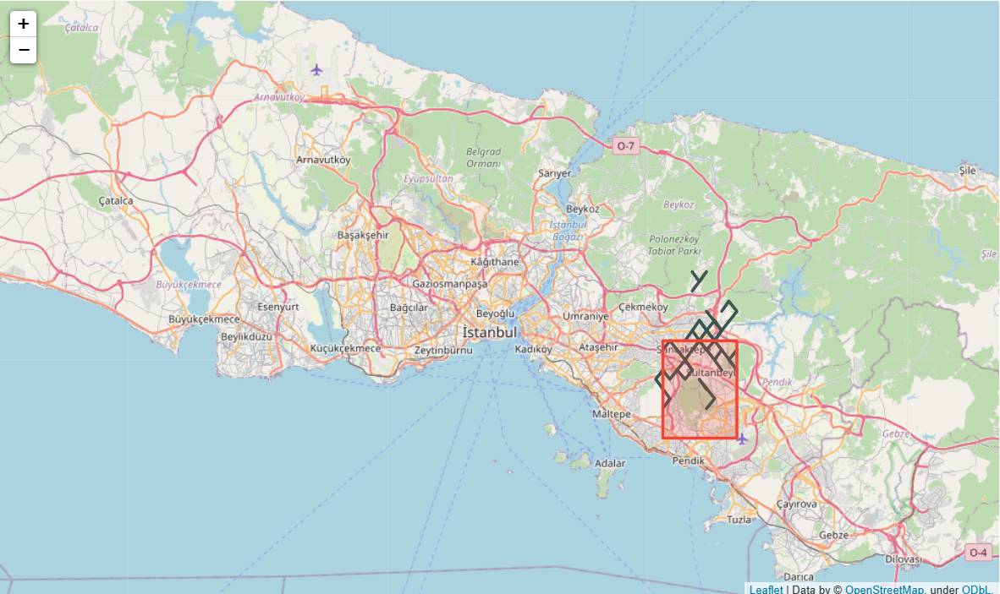
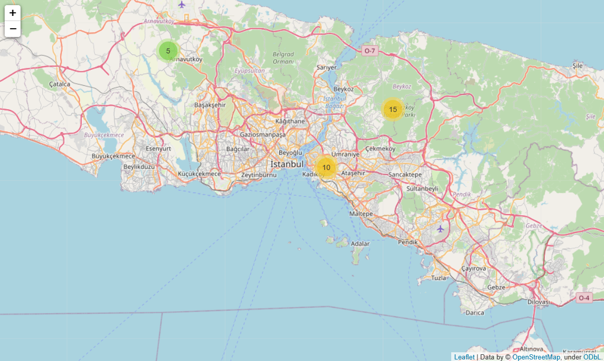

# Geodata_Analysis
 Geodata Analysis with Geopandas and Folium packages. We create lines, polygones on Istanbul map using "geopandas" library. Moreover we use "folium" package to make the map interactive with the help of Marker and MarkerCluster objects of folium.
  

  
